# Conceitos Básicos de Desenvolvimentos

## Criando um Novo Projeto

* Após abrir o GDevelop, iremos começar um novo projeto em branco clicando no botão **Create Blank Project** na página inicial:
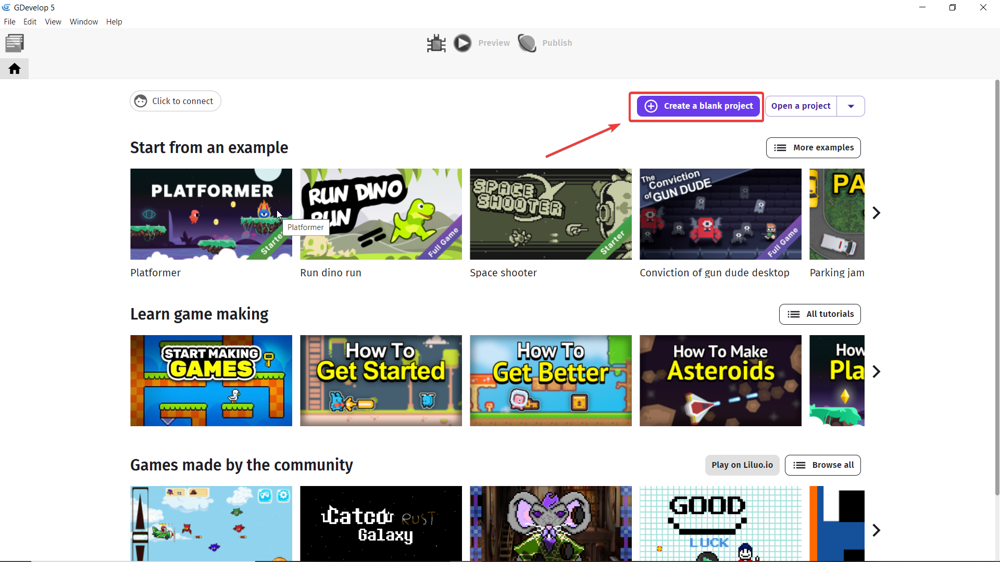

* Na tela de Novo Projeto, devemos dar um nome para o mesmo **(1)**, e selecionar o diretório onde ele ficará salvo **(2)**. Após isso, clique no botão **Create Project (3)**, então GDevelop irá preparar o ambiente de desenvolvimento.
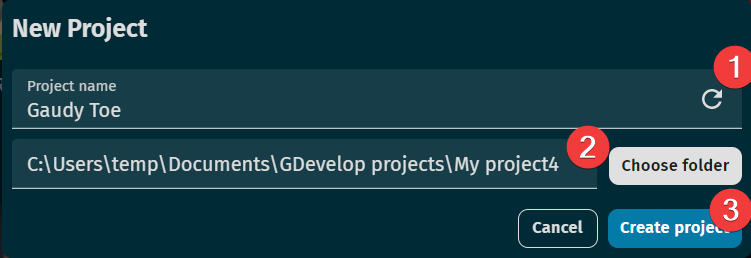
## Entendendo a HUD do GDevelop

* Após o término da criação do projeto, teremos uma tela inicial similar a abaixo. Segue uma breve descrição de cada área.

    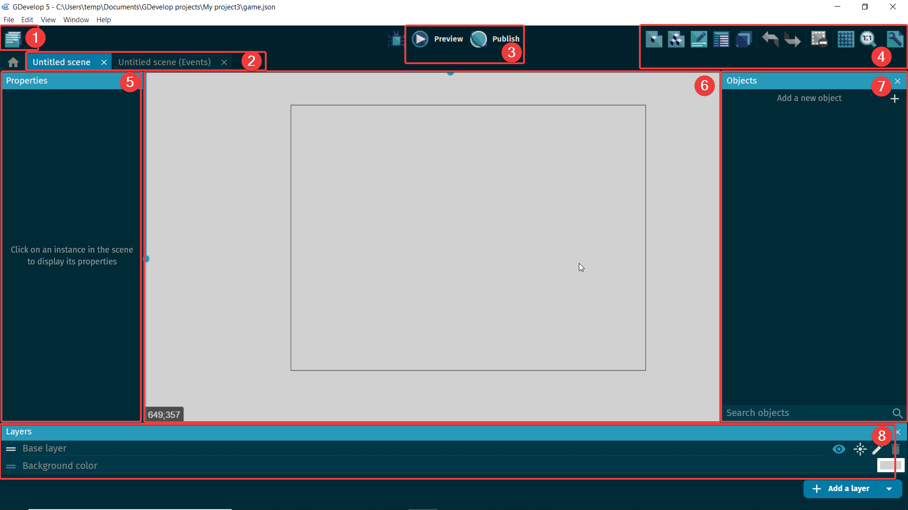

    * **1 - Menu de Propriedades do Projeto:** Aqui configuramos diversas propriedades do projeto, como cenas, tamanho da Tela, Variáveis Globais, definições de publicação, etc.

    * **2 - Abas do Projeto:** Nesta área nós somos capazes de trocar entre os cenários do nosso projeto, assim como dos Eventos. Cada cena criada possui uma aba de Eventos atrelada nela como padrão.

    * **3 - Teste e Publicação do Projeto:** O Botão ***Preview*** permite que executemos nosso projeto sem necessidade de publicá-lo ou construir um executável para o mesmo. Já o Botão ***Publish*** é onde iremos preparar todos os arquivos do projeto para publicá-lo e permitir que outras pessoas possam jogá-lo

    * **4 - Menu de Edição da Tela:** Estes botões são responsáveis por abrir diversas telas que utilizamos no GDevelop, como a Tela de Propriedades **(5)**, ou a tela de Objetos **(7)**. Além disso, possui botões para desfazer e refazer alterações no projeto, configurar a tela de fundo, adicionar uma grade, Zoom, etc.

    * **5 - Tela de Propriedades:** Esta tela apresenta todas as propriedades de uma instância de um objeto selecionado da cena, como posição, tamanho, entre outros, Podemos editar todas essas informações a partir desta tela.

    * **6 - Cena:** Aqui temos a nossa área de criação, ou a Cena propriamente dita. É nesta região em que nós efetivamente construímos o mundo, adicionando instâncias de objetos e organizando-os como queremos. Alterações feitas na Tela de Propriedades são também refletidas aqui.

    * **7 - Tela de Objetos:** Aqui nós temos uma lista de todos os objetos que criamos em nosso projeto, podendo selecioná-los para adicionar uma nova instância dele na cena, ou alterar suas propriedades, como imagem, variáveis e comportamentos.

    * **8 - Tela de Camadas:** Esta tela mostra as diversas camadas do nosso Projeto. Camadas são importantes para organizar as Instâncias de Objetos do nosso projeto.

    Nós iremos nos aprofundar em cada uma destas seções do GDevelop com o avançar deste tutorial, mas agora que temos uma ideia básica de cada uma delas, podemos começar a navegar pela Engine para criarmos nosso projeto efetivamente.

## Criando o Primeiro Objeto

* Para efetivamente criarmos nosso jogo, precisamos trabalhar com ***Objetos***. As propriedades de um Objeto são definidas pelo seu ***Tipo***. O tipo mais comum de objeto utilizado em um projeto no GDevelop é o ***Sprite***, e este será o que utilizaremos primeiro.

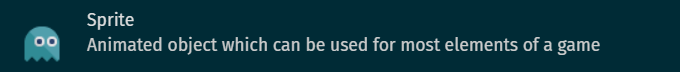

* Após clicar na Opção Sprite, surgirá a Tela de Propriedade do Sprite. Nela nós podemos definir todos os dados principais do objeto, como seu nome, animações, suas variáveis e comportamentos.

    Antes de definirmos as propriedades mais avançadas do nosso sprite, precisamos definir seu nome e sua imagem. Em ***Object Name***, digite o nome desejado para seu Sprite, lembrando que este nome deve ser algo que caracterize este objeto, como por exemplo “Herói” ou um nome próprio. Após isso, nós devemos clicar no botão ***Add an Animation*** para colocar uma imagem no Sprite.

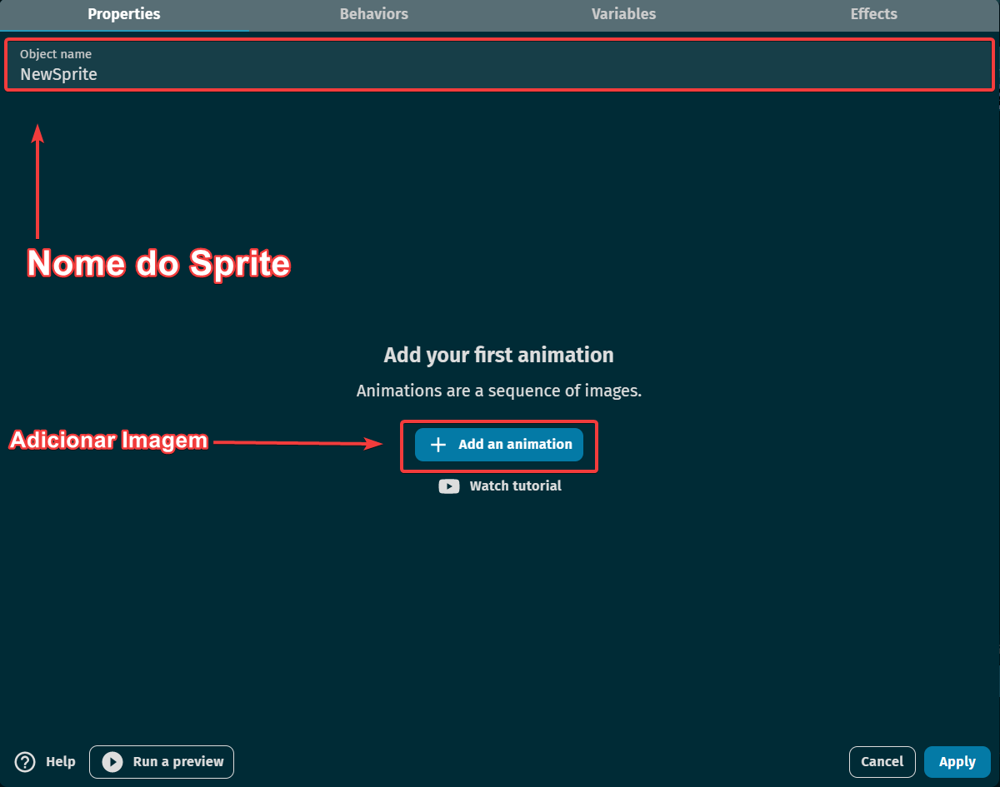

* Ao clicar em Add Animation, teremos na tela nossa ***Animation #0 (1)***, que será a primeira instância de imagem do nosso Objeto.
    Um Sprite trabalha com animações, que são formadas por uma sequência de imagens que geram um determinado movimento de uma ação. Exemplos de animações mais comuns que um Sprite possui são a de estado **parado(Idle)**, e **em movimento(Walk/Run)**, mas para cada ação que nosso Sprite pode realizar, podemos ter uma animação que irá ser utilizada em conjunto para representar o movimento do Sprite realizando esta ação.

* Caso você queira adicionar mais animações no seu Sprite, basta clicar em ***+ Add an Animation (2)***, e uma nova linha de Animação irá aparecer.

* Para adicionar uma ou mais imagens em uma animação, você pode clicar em ***+ Add*** e selecionar as imagens que deseja utilizar de um diretório.
Alternativamente, podemos utilizar o Piskel para inserir e fazer edições melhores em nossas imagens da animação, utilizando o Botão ***Edit with Piskel***, o qual veremos como utilizar mais a frente.

* Além do Piskel, nós temos o botão ***Preview***, onde podemos ver como a nossa sequência de imagens está funcionando para criar a animação em questão. Dentro da tela de preview, nós teremos a tela da animação rodando ***(1)***, e abaixo as configurações de velocidade da animação ***(2)***.
Nas configurações de velocidade, nós temos dois valores: o ***FPS(Frames per Second)***, que indica quantos quadros nossa animação anda por em um segundo de execução, e ao seu lado nós temos o ***tempo de execução da animação***. 
    
    Estes valores estão sempre conectados, de tal forma que ***quanto maior for nosso valor de FPS, menor será o tempo de execução da animação***, e vice-versa. Logo, para animações mais simples, o ideal é termos uma taxa de FPS menor para ela, para alcançar um tempo de execução melhor desta animação.
    
    O GDevelop irá tentar otimizar estes valores de acordo com a quantidade de quadros que colocarmos, mas em alguns casos podemos sempre alterar estes valores.

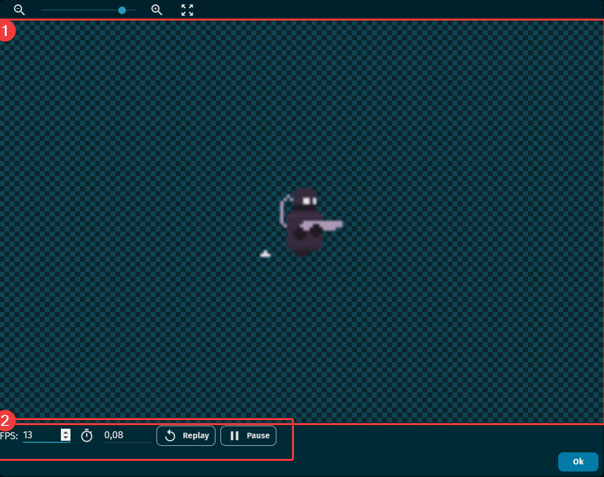

* Finalizando, após a parte de Preview, nós temos uma opção chamada ***Loop***. Esta função irá fazer com que a animação em questão fique em repetição infinita. O *Loop* é especialmente útil quando fazemos animações de movimento.

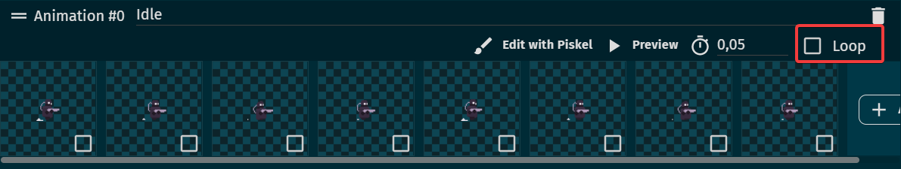

* Após criarmos nossas animações, nós devemos verificar duas partes do nosso Sprite para que ele funcione de forma correta em nosso projeto: as ***Máscaras de Colisão***, e os ***Pontos***.

    Nós podemos editar ambos utilizando seus respectivos botões no canto inferior esquerdo da tela do Objeto, como mostrado na imagem abaixo.

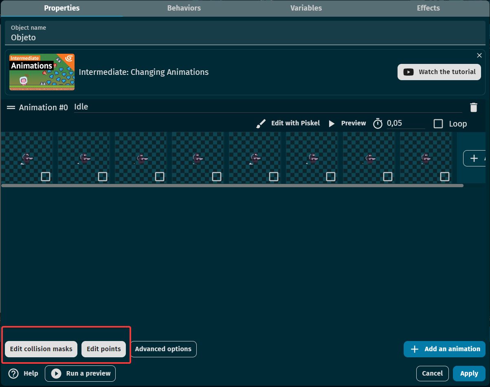

## Máscaras de Colisão

* *Máscaras de Colisão* representam a parte “física” do seu Sprite. Dentro do GDevelop, toda a interpretação de contato entre dois ou mais objetos é dada através da colisão de suas máscaras. Ela é, de forma simplificada, a “Pele” do Sprite.

    Dado isto, é importante arrumar a máscara de Colisão para que ela cubra nosso Sprite o mais justo possível, para evitar que colisões aconteçam de forma errônea.

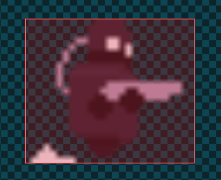{width=200; align=center}
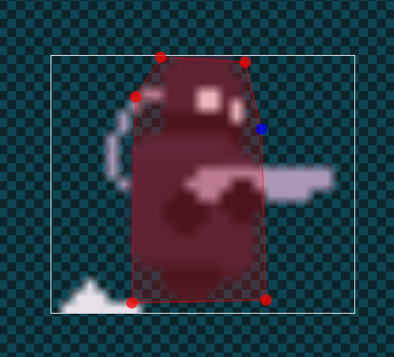{width=180; align=center}

No Exemplo A, podemos ver que a máscara de colisão está pegando toda nossa imagem. Porém, existem elementos nela, como a poeira e a arma, que não fazem parte do “Corpo” do nosso personagem. Sendo assim, o ideal é ajustar nossa máscara  para que ela cubra somente o que é realmente o “Corpo” do personagem, assim como o Exemplo B.

* No GDevelop, para editarmos a máscara padrão de colisão, precisamos clicar no botão ***Use a Custom collision mask*** dentro da tela de edição de colisões.

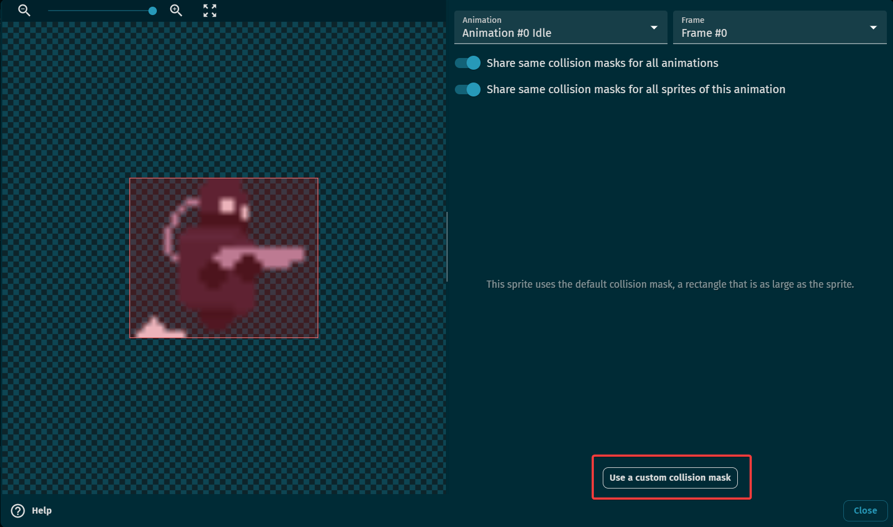

Após criarmos uma colisão personalizada, podemos ajustá-la de forma simples arrastando seus pontos ao redor da região em que queremos. Caso seja necessário mais pontos para ajustar a máscara, basta clicar no botão ***Add a Vertex***, que um novo ponto surgirá no topo esquerdo da imagem.

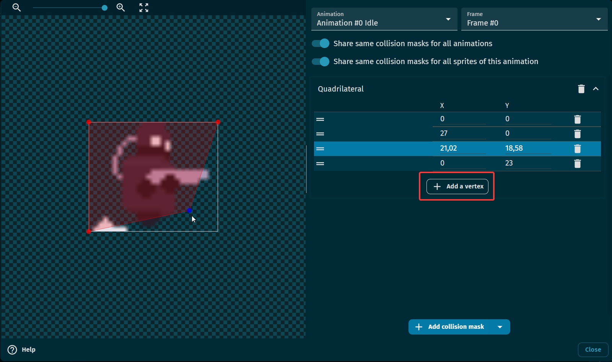

* De forma padrão, o GDevelop altera a máscara de colisão de **TODAS** as animações e seus respectivos frames juntos. Caso seja necessário termos máscaras distintas entre animações, ou entre frames, precisamos desativar os ajustes automáticos de animação **(1)** e frames **(2)**:

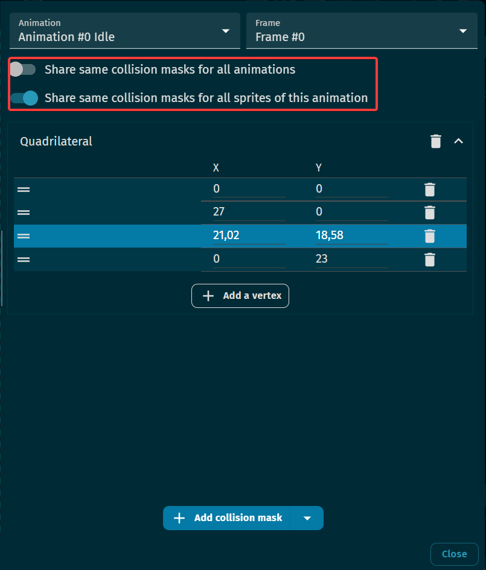

## Pontos

* Pontos são referências de um espaço dentro de uma  imagem. Assim como máscaras de colisão, podemos utilizar pontos para calcular a colisão entre objetos, e também para determinar a posição de um objeto numa cena.
Por padrão, um Sprite possui dois Pontos: O Ponto de Origem **(1)**, que determina o espaço inicial de onde a imagem do Sprite vai surgir (0,0), e o ponto Central **(2)**, que fica automaticamente centralizado no Sprite.

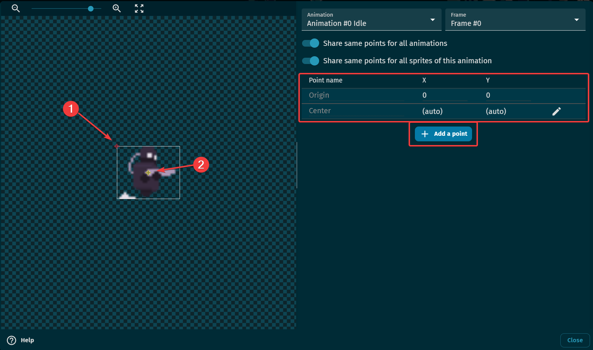

* A edição de pontos é muito similar ao de máscaras de colisão, e todos os pontos são por padrão existentes em todas as animações e frames de um Sprite, mas podemos mudar isso caso seja necessário também.

## Comportamentos

* Com o básico de um Objeto criado, agora vamos dar uma olhada em uma das partes mais importantes da programação No-Code no GDevelop: ***Behaviors***, ou ***Comportamentos***.
Para adicionar um novo comportamento, basta irmos na aba Behavior dentro das opções do Objeto, e clicar em ***+Add Behavior***.

    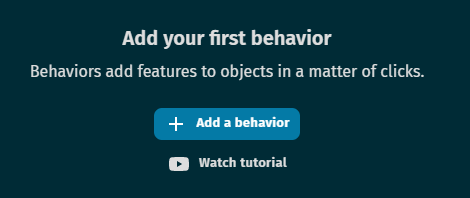

    Cada tipo de Objeto possui seus comportamentos, e você é capaz de adicionar múltiplos comportamentos em um mesmo objeto para acessar suas funcionalidades. Aqui iremos explicar os tipos de comportamentos mais comuns que iremos utilizados num projeto:

    * **Platform** faz com que o objeto seja marcado como uma plataforma sólida no qual outros objetos podem andar sobre.
    
    * **Platform Character** é o comportamento ideal para um Objeto que terá movimento em um jogo Plataforma, como Mario. Ele também atribui Física ao objeto, fazendo-o cair na falta de uma plataforma, pular, subir um objeto que seja uma escada, ter uma velocidade e aceleração de movimento, etc.

    * **Anchor** faz com que um objeto fique fixado em uma posição da tela, independente do movimento da mesma. É um comportamento interessante para criar a Interface do seu jogo.
    
    * **Destroy when outside of the screen** é útil para limparmos alguns tipos de objetos após ele sair da nossa área de visão do jogo, como projéteis.

    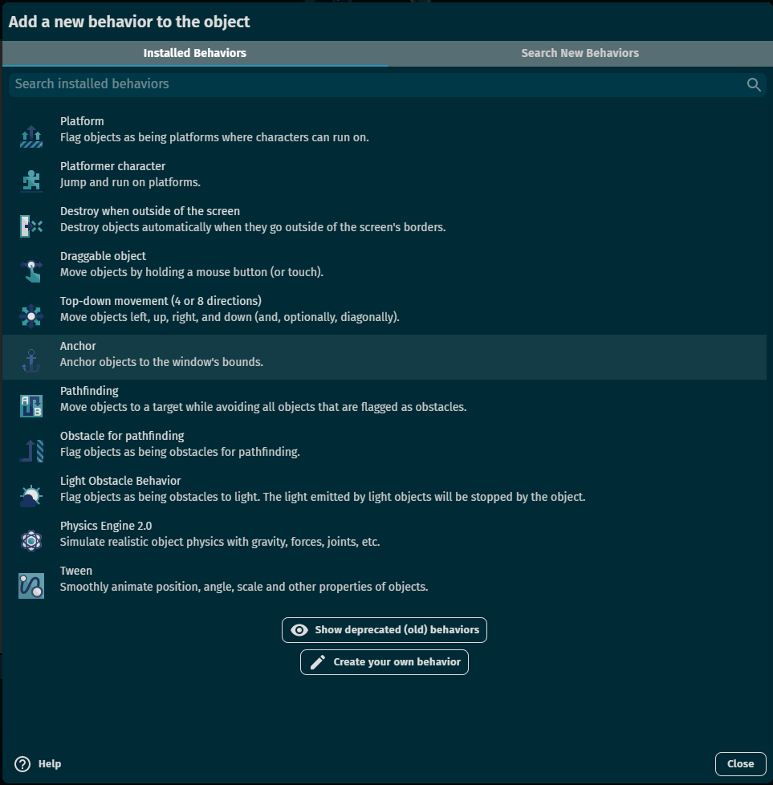

* Após selecionar seu comportamento, ele exibirá opções que podem ser ajustadas de acordo com a sua necessidade. O comportamento de Platform Character permite que você ajuste todas as velocidades do Objeto em movimento, se o movimento dele será feito através dos controles padrões da ferramenta, entre outras funções.

## Variáveis

* Variáveis são utilizadas para criar atributos modificáveis em um objeto ou no projeto. Quando criamos uma variável em um objeto, ela será utilizada para definir alguma característica deste objeto que pode ser modificada durante o jogo. Um exemplo prático para isto é a Vida de um Personagem.
Quando criamos uma variável para o projeto, o que chamamos de **Variável Global**, ela é utilizada para armazenar alguma informação que será reutilizada em várias cenas e momentos do nosso projeto, como por exemplo uma pontuação.

* Para criar uma variável em um Objeto, basta irmos na aba **Variables (1)** dentro da edição do objeto, e clicar no botão **Add a Variable (2)**, como na imagem abaixo:

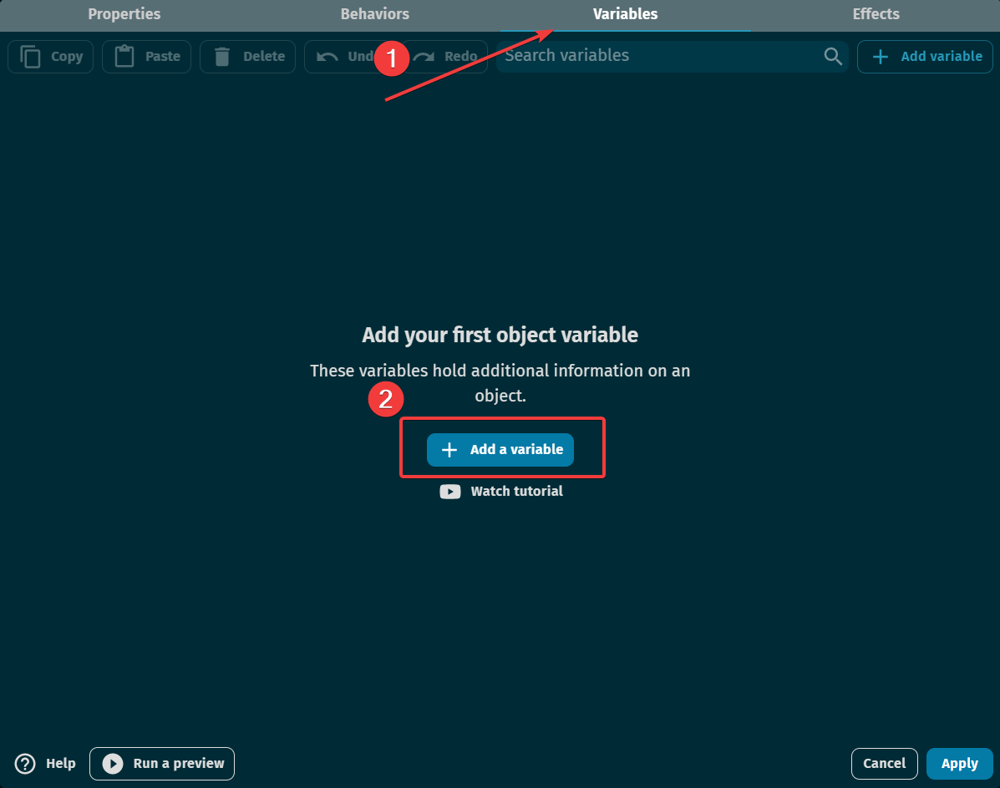

* Ao criar uma variável, temos que definir alguns parâmetros da mesma:
    * **Nome:** Um nome que irá identificar esta variável. Quando trabalhos com variáveis de objetos, estes podem possuir variáveis com nomes iguais entre eles. Por exemplo, um objeto Personagem e um objeto Inimigo podem possuir uma variável Vida com valores diferentes.
    * **Tipo:** Uma variável precisa ter um tipo definido, o que irá ditar o que ela poderá armazenar dentro dela. São estes tipos:
        * **String:** Capaz de armazenar textos;
        * **Number:** Capaz de armazenar valores numéricos;
        * **Boolean:** Armazena um valor de True ou False para lógicas booleanas;
        * **Array:** Armazena um conjunto de valores dentro dele, separados pela sua posição dentro da lista numericamente.
        * **Structure:** Armazena um conjunto de variáveis dentro dele.
    * **Valor Inicial:** Define um valor inicial para esta variável.

* Para criar uma variável global, temos que ir nas propriedades do Projeto, clicando no botão no canto superior esquerdo do projeto e, em seguida, clicar no botão ***Global Variables (2)***  que está dentro da aba ***Game Settings (1)***. as definições de uma variável global são os mesmo para uma variável de um objeto.

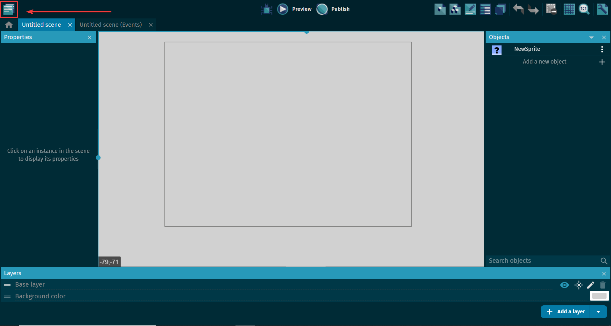{width=500; align=top}
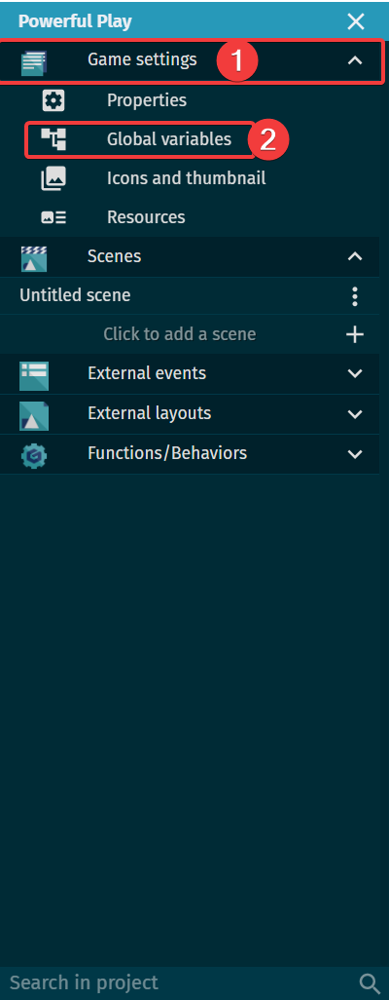{width=150}

## Adicionando Objetos na Cena
* Após criarmos nosso objeto, ele ficará na aba Objetos do nosso projeto, porém para adicionarmos ele na nossa Cena atual, é necessário criar Instâncias do mesmo nela.

* Para criar uma Instância de um Objeto, basta clicar e arrastar o objeto com o mouse, posicionando-o em algum lugar dentro da cena. Uma mesma cena pode possuir múltiplas instâncias de um objeto

* Cada Cena possui seus objetos de forma independente, mas você pode reutilizar objetos já criados de uma cena para outra se você tornar o mesmo Global. Para isso, basta clicar com botão direito no Objeto, e selecionar a opção ***Set as Global Object***.

* Após adicionar uma instância de um objeto em uma Cena, você poderá ajustar seus parâmetros de cena, como tamanho e posição, na aba de Parâmetros, localizada no canto esquerdo do GDevelop, como exibido no início deste tutorial.

## Camadas
* As instâncias de um objeto ficam todas dentro de uma camada quando adicionadas numa cena. Por padrão, o GDevelop possui a camada ***Base Layer***, porém podemos criar mais camadas para melhor dividir as instâncias dentro de uma cena.

* O uso de camadas é importante para determinar a ordem em que os objetos estão sobrepostos um do outro. Na aba de Camadas, o que determinar esta sobreposição é a ordem das camadas, com a primeira camada sendo a que estará mais ao “topo” das sobreposições

    Se criarmos, por exemplo, uma camada Fundo, e uma camada Interface, podemos organizar nossas instâncias de objetos entre essas camadas, colocando objetos do cenário e de fundo na camada Fundo, que ficará por último na ordem de camadas, e objetos como Barra de Vida, Pontuação, na camada Interface, que ficará em primeiro na ordem de camadas, com a camada Base Layer entre elas, com objetos como Personagens, Inimigos, plataformas e coletáveis.
* Para criar uma camada, basta clicar no botão ***Add a Layer*** na Tela de Camadas, e para alternar suas ordens basta clicar no ícone ao lado esquerdo do nome da camada e arrastá-lo para a posição desejada. Lembre de colocar um nome para as camadas criadas.
* Caso deseje esconder uma camada, basta clicar no ícone de olho no canto direito da camada, e para apagar uma camada, clique no ícone de lixeira da mesma.

## Eventos

* Além de trabalhar com objetos, a outra parte importante para criar um projeto no GDevelop consiste em trabalhar com **Eventos**.
Um Evento consiste de uma **Condição**, que é um requisito para o evento, e de uma **Ação**, que é a execução de uma função dentro do evento.

* Para criarmos estes eventos, devemos ir para a aba de Eventos da cena em que estamos trabalhando. Cada cena possui seus próprios eventos, porém também podemos criar eventos externos a cenas que podem ser utilizados em múltiplas cenas ao serem chamados.

* Ao entrar numa aba de eventos, para criar um primeiro evento basta clicar no botão ***Add a Event (1)*** no centro da tela, que então irá criar uma linha de evento no topo da tela. Também temos um botão de adicionar um novo evento no fim da nossa sequência de eventos ***(2)***

* Após criar uma linha evento, para adicionar uma condição basta clicar em ***Add a condition (3)*** na parte esquerda do evento, e para adicionar uma ação, clicar em ***Add an action (4)*** na parte direita.

    Um evento pode ter múltiplas condições e ações. Para um evento ser executado, todas suas condições devem acontecer, e isto fará que todas suas ações sejam executadas na ordem em que estão.

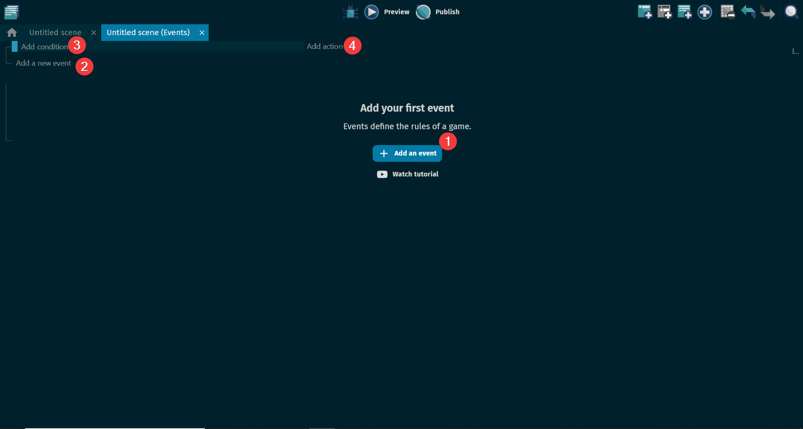

* Ao clicar para adicionar uma condição ou ação, teremos que escolher quem ou o que irá gerar estes. Podemos selecionar um objeto criado ***(1)***, ou uma propriedade do projeto ***(2)*** para gerar as condições e ações.
Ao selecionar a origem, podemos configurar parâmetros específicos desta condição ou ação, caso possuam ***(3)***. Por fim, basta clicar em **Ok** para concluir a criação.

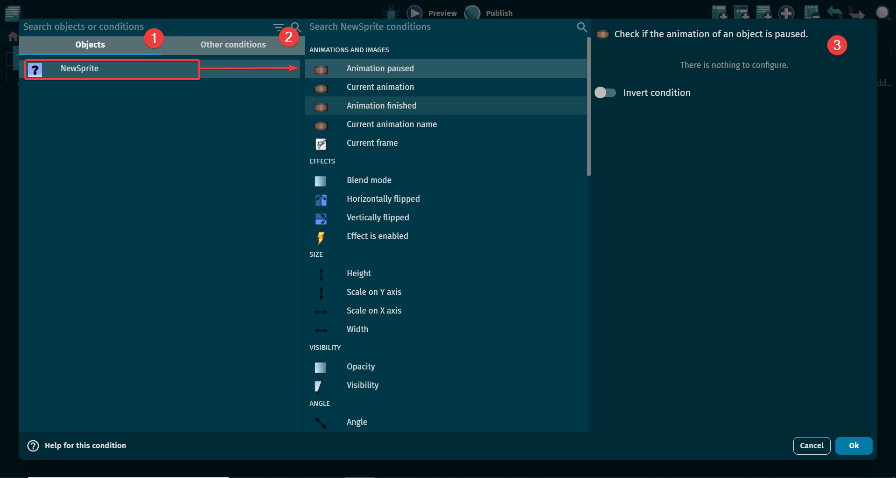

## Conclusão
Com estas noções, você está pronto para começar a criar seu primeiro projeto usando o GDevelop. 
Lembre sempre de tirar dúvidas e sugestões com os professores, e também de conversar com seus companheiros para ter novas ideias para o projeto, afinal o trabalho em equipe é essencial.

***DIVIRTAM-SE!!!!*** 😄
